# Databricks and Apache Airflow 3.0 Integration Project

## Introduction

This project demonstrates a robust and scalable data orchestration and processing pipeline leveraging **Databricks** for data engineering and analytics, integrated with **Apache Airflow 3.0** for workflow management. The architecture incorporates modern cloud-native practices, including containerization with **AWS ECR**, version control with **GitHub**, and dynamic task execution on a **Kubernetes Cluster**.

The core idea is to use Airflow to orchestrate complex data workflows. Specifically, Airflow is configured to **trigger the update of source data from external APIs on the internet**. This data is then **pushed to AWS S3 by Airflow**, which in turn **triggers a Databricks pipeline** for further processing, transformation, and analysis. This setup ensures a clean separation of concerns: Airflow manages the scheduling, monitoring, and initial data ingestion, while Databricks handles the heavy data processing and analytics. DAGs (Directed Acyclic Graphs) are managed via GitSync for seamless deployment, and custom Docker images ensure consistent environments for Airflow tasks.

## Architecture Diagram

### System Architecture

The following diagram illustrates the high-level system architecture and the flow of data and control within the system.



### Architecture Description

The architecture consists of several key components working together:

**1. Data Ingestion Layer (Airflow)**

- **External API Integration**: Airflow tasks fetch data from internet APIs
- **S3 Upload**: Raw data is pushed to AWS S3 for storage
- **S3 Event Triggers**: S3 events automatically trigger Databricks workflows

**2. Development & Version Control (GitHub)**

- **Airflow DAGs**: Workflow definitions stored as Python files
- **Databricks Notebooks**: Data processing logic converted to `.py` files
- **Version Control**: All code changes tracked and managed through Git

**3. CI/CD Pipeline (GitHub Actions)**

- **Automated Builds**: Triggers on push to main branch
- **Docker Images**: Builds custom Airflow images with dependencies
- **ECR Push**: Stores images in AWS Elastic Container Registry

**4. Kubernetes Cluster (Local Development with Kind)**

- **Airflow Components**: Scheduler, Webserver, and Workers
- **GitSync Sidecar**: Automatically syncs DAGs from GitHub every 5 seconds
- **Task Execution**: Runs DAG tasks in isolated containers
- **Persistent Storage**: Logs and data persisted across restarts

**5. Data Processing Pipeline (Databricks)**

- **Bronze Layer**: Raw data ingestion and initial quality checks
- **Silver Layer**: Data cleaning, transformation, and standardization
- **Gold Layer**: Business logic, aggregations, and analytics
- **Dashboard Generation**: Final insights and visualizations

**6. Data Storage & Governance**

- **AWS S3**: Object storage for raw and processed data
- **Unity Catalog**: Metadata management and data governance
- **Spark Clusters**: On-demand compute for data processing

## Key Features

### 🚀 **Modern Architecture**

- **Apache Airflow 3.0** with Kubernetes Executor
- **GitSync Integration** for automatic DAG deployment
- **Containerized Environment** with custom Docker images
- **Cloud-Native Design** using AWS ECR and S3

### 🔄 **Automated CI/CD**

- **GitHub Actions** for continuous integration
- **Automated Image Building** and ECR deployment
- **Zero-Downtime Deployments** with rolling updates
- **Version Control** for all code and configurations

### 📊 **Data Processing Pipeline**

- **Databricks Integration** for scalable data processing
- **Spark Job Orchestration** via Airflow operators
- **Data Lakehouse Architecture** with Unity Catalog
- **Automated ETL Workflows** with error handling

### 🛠 **Developer Experience**

- **Local Development** with Kind Kubernetes cluster
- **Hot Reload** of DAGs via GitSync
- **Persistent Logs** and debugging capabilities
- **Comprehensive Documentation** and setup scripts

## Quick Start

### Prerequisites

- Docker Desktop
- AWS CLI configured
- kubectl installed
- Helm 3.x installed

### 1. Clone and Setup

```bash
git clone https://github.com/Binh-SPU/databricks-airflow.git
cd databricks-airflow
```

### 2. Local Development (Kind)

```bash
# Install Airflow with persistence
./install_airflow_with_persistence.sh

# Or install with ECR integration
./install_airflow_with_ecr.sh
```

### 3. Access Airflow UI

```bash
# Port forward to access Airflow UI
kubectl port-forward svc/airflow-api-server 8080:8080 -n airflow

# Open browser: http://localhost:8080
# Default credentials: admin/admin
```

### 4. Deploy to Production

```bash
# Push to main branch triggers GitHub Actions
git add .
git commit -m "Deploy to production"
git push origin main
```

## Project Structure

```
databricks-airflow/
├── .github/workflows/          # CI/CD pipeline definitions
├── chart/                      # Helm chart configurations
├── cicd/                       # Docker build files
├── dags/                       # Airflow DAG definitions
├── k8s/                        # Kubernetes manifests
├── notebooks/                  # Databricks notebooks
├── tmp/                        # Local logs and data (gitignored)
├── install_airflow.sh          # Basic installation script
├── install_airflow_with_persistence.sh  # Installation with persistence
├── install_airflow_with_ecr.sh # Installation with ECR integration
├── push_to_ecr.sh             # Manual ECR push script
└── requirements.txt            # Python dependencies
```

## Configuration

### Environment Variables

```bash
# AWS Configuration
export AWS_REGION=us-west-1
export ECR_REGISTRY=549802553860.dkr.ecr.us-west-1.amazonaws.com

# Airflow Configuration
export NAMESPACE=airflow
export RELEASE_NAME=airflow
```

### GitHub Secrets

Configure these secrets in your GitHub repository:

- `AWS_ACCESS_KEY_ID`: AWS access key
- `AWS_SECRET_ACCESS_KEY`: AWS secret key
- `ECR_REGISTRY`: ECR registry URL

## DAG Examples

### 1. Data Processing Pipeline

```python
from airflow import DAG
from airflow.providers.databricks.operators.databricks import DatabricksSubmitRunOperator

dag = DAG(
    'produce_data_assets',
    schedule_interval='@daily',
    catchup=False
)

# Trigger Databricks job
databricks_task = DatabricksSubmitRunOperator(
    task_id='run_spark_job',
    databricks_conn_id='databricks_default',
    new_cluster={
        'spark_version': '13.3.x-scala2.12',
        'node_type_id': 'i3.xlarge',
        'num_workers': 2
    },
    spark_python_task={
        'python_file': 'dbfs:/path/to/your/notebook.py'
    }
)
```

### 2. Workflow Orchestration

```python
from airflow import DAG
from airflow.operators.bash import BashOperator

dag = DAG(
    'trigger_databricks_workflow',
    schedule_interval='0 2 * * *',  # Daily at 2 AM
    catchup=False
)

# Data validation
validate_task = BashOperator(
    task_id='validate_data',
    bash_command='python /opt/airflow/dags/validate.py'
)

# Trigger Databricks
trigger_task = DatabricksSubmitRunOperator(
    task_id='trigger_databricks',
    # ... configuration
)

# Data quality check
quality_task = BashOperator(
    task_id='quality_check',
    bash_command='python /opt/airflow/dags/quality_check.py'
)

validate_task >> trigger_task >> quality_task
```

## Monitoring and Logging

### Airflow UI

- **DAG View**: Monitor workflow execution
- **Task Logs**: Detailed execution logs
- **Graph View**: Visualize task dependencies
- **Gantt Chart**: Timeline analysis

### Persistent Logs

```bash
# View logs locally
ls -la tmp/logs/

# View logs in cluster
kubectl logs -n airflow <pod-name> -c <container-name>
```

### Health Checks

```bash
# Check pod status
kubectl get pods -n airflow

# Check DAG processing
kubectl logs -n airflow -l component=dag-processor -c dag-processor
```

## Troubleshooting

### Common Issues

**1. DAGs not appearing**

```bash
# Check GitSync logs
kubectl logs -n airflow -l component=dag-processor -c git-sync

# Verify repository access
kubectl get secret git-credentials -n airflow -o yaml
```

**2. Image pull errors**

```bash
# Check ECR authentication
aws ecr get-login-password --region us-west-1 | docker login --username AWS --password-stdin <registry>

# Verify image exists
aws ecr describe-images --repository-name my-dags-repo --region us-west-1
```

**3. Permission issues**

```bash
# Fix log directory permissions
docker exec kind-worker chown -R 50000:0 /mnt/airflow-data/logs
```

## Related Technologies and Concepts

### Core Technologies

- **[Apache Airflow 3.0](https://airflow.apache.org/)**: Workflow orchestration platform
- **[Databricks](https://databricks.com/)**: Unified data analytics platform
- **[Kubernetes](https://kubernetes.io/)**: Container orchestration
- **[AWS ECR](https://aws.amazon.com/ecr/)**: Container registry service
- **[AWS S3](https://aws.amazon.com/s3/)**: Object storage service

### Development Tools

- **[Kind](https://kind.sigs.k8s.io/)**: Local Kubernetes development
- **[Helm](https://helm.sh/)**: Kubernetes package manager
- **[Docker](https://www.docker.com/)**: Containerization platform
- **[GitHub Actions](https://github.com/features/actions)**: CI/CD automation

### Data Concepts

- **[Data Lakehouse](https://databricks.com/glossary/data-lakehouse)**: Modern data architecture
- **[ETL/ELT](https://en.wikipedia.org/wiki/Extract,_transform,_load)**: Data processing patterns
- **[GitOps](https://www.gitops.tech/)**: Git-based operations
- **[Infrastructure as Code](https://en.wikipedia.org/wiki/Infrastructure_as_code)**: Automated infrastructure management

### Airflow Concepts

- **[DAGs](https://airflow.apache.org/docs/apache-airflow/stable/concepts/dags.html)**: Directed Acyclic Graphs
- **[Operators](https://airflow.apache.org/docs/apache-airflow/stable/concepts/operators.html)**: Task execution units
- **[GitSync](https://airflow.apache.org/docs/apache-airflow/stable/howto/sync-dags.html)**: DAG synchronization
- **[Kubernetes Executor](https://airflow.apache.org/docs/apache-airflow/stable/executor/kubernetes.html)**: Dynamic task execution

## Contributing

1. Fork the repository
2. Create a feature branch (`git checkout -b feature/amazing-feature`)
3. Commit your changes (`git commit -m 'Add amazing feature'`)
4. Push to the branch (`git push origin feature/amazing-feature`)
5. Open a Pull Request

## License

This project is licensed under the MIT License - see the [LICENSE](LICENSE) file for details.

## Acknowledgments

- Apache Airflow community for the excellent orchestration platform
- Databricks team for the unified analytics platform
- Kubernetes community for container orchestration
- AWS for cloud infrastructure services

---

**Built with ❤️ for modern data engineering**
